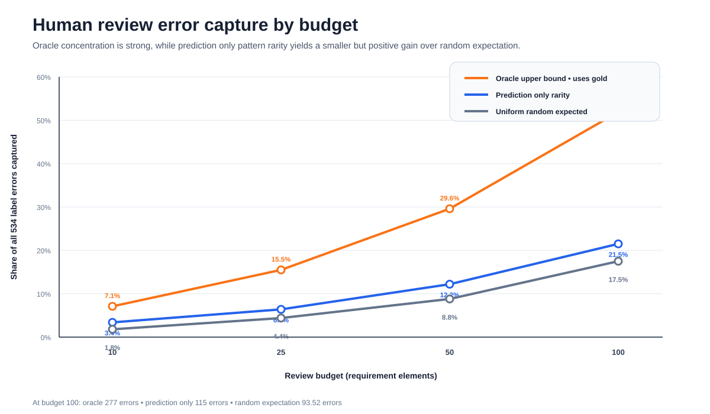

# Requirements Classification Evidence Triage on a Gold-Standard Benchmark

> **Empirical Research Bundle** · **Portfolio Track: Engineering Management Research** · Requirements Engineering / Human-in-the-Loop Review / Evidence Triage

A reproducible secondary study of 571 eTour requirement elements that separates **classification quality**, an **oracle review-efficiency ceiling**, and a **deployable prediction-only triage heuristic**.


## Study status

**Completed secondary empirical analysis with deployable-vs-oracle triage evaluation.** The source is pinned to FTLR replication commit `02682a0d3cb2fb991942c2d88d11e03221f30f87`, so the benchmark cannot silently change when an upstream branch moves.

## Research questions

1. Where does automatic fine-grained requirements classification fail across Function, Behavior, Data, F, and UserRelated?
2. How concentrated are those errors under a gold-label oracle review queue?
3. Can a review queue built only from automatic predictions capture more errors than uniform random review?

## Source

- **Gold-standard dataset:** eTour subset of *Dataset for Requirements Classification in Traceability Link Recovery Datasets*
- **Gold dataset DOI:** concept DOI `10.5281/zenodo.7867845`; versioned Zenodo record `10.5281/zenodo.7867846`
- **Automatic classifications:** NoRBERT for TLR / FTLR replication outputs
- **NoRBERT artifact:** concept DOI `10.5281/zenodo.8348363`
- **Pinned replication commit:** `02682a0d3cb2fb991942c2d88d11e03221f30f87`
- **Analysis date:** 2026-09-25

## Classification results

| Label | Precision | Recall | F1 |
|---|---:|---:|---:|
| Function | 0.790 | 0.883 | 0.834 |
| Behavior | 0.744 | 0.962 | 0.839 |
| Data | 0.701 | 0.796 | 0.746 |
| F | 0.899 | 0.996 | 0.945 |
| UserRelated | 0.933 | 0.502 | 0.653 |

The largest weakness is **UserRelated recall (0.502)**, while the broad `F` label reaches **0.945 F1**.


## Human-review triage

The original prototype ranked items by their **actual gold-vs-prediction errors**. That ranking is retained only as an **oracle upper bound** because it uses the answer key and cannot be deployed before review.

This release adds a prediction-only heuristic: **prediction-pattern rarity**. It ranks uncommon five-label prediction patterns first, then uses prediction-only hierarchy inconsistency and label density as deterministic tie-breakers. Gold labels are used only afterward to evaluate the queue.

| Review budget | Oracle error capture | Prediction-only capture | Random expected | Prediction-only enrichment |
|---:|---:|---:|---:|---:|
| 10 | 7.1% | 3.4% | 1.8% | 1.93× |
| 25 | 15.5% | 6.4% | 4.4% | 1.45× |
| 50 | 29.6% | 12.2% | 8.8% | 1.39× |
| 100 | 51.9% | 21.5% | 17.5% | 1.23× |

The deployable heuristic is **exploratory and post hoc**. It beats the expected uniform-random capture rate on this benchmark, but it is not claimed to be externally validated or optimal.



## Claim boundary

**Can claim:** the five confusion matrices reproduce from the pinned public source; there are 534 five-label errors; the 51.9% result is an oracle ceiling; the prediction-only queue captures 115 errors in its top 100 versus 17.5% expected under uniform random review.

**Cannot claim:** that the oracle queue is operational, that pattern rarity is optimal or externally validated, or that requirement-element classification is equivalent to end-to-end system verification.

The four source fields `functional`, `OnlyF`, `OnlyQ`, and `Q` are excluded because the supplied automatic eTour file is degenerate for those fields.


## Reproduce

```bash
python -m pip install -r requirements.txt
pytest -q
python run_demo.py
python scripts/generate_figures.py --out-dir /tmp/requirements_figures
python scripts/fetch_and_analyze.py --check
```

The public-source rebuild prints SHA-256 hashes for both commit-pinned CSV files and fails if the complete derived evidence or released metrics differ.

## Research bundle contents

- `data/derived/evaluation_observations.csv` — complete 571-row derived evaluation evidence
- `data/derived/primary_results.csv` — five label-level confusion/F1 summaries
- `data/derived/triage_results.csv` — oracle, prediction-only, and random-expected review curves
- `results/empirical_summary.json` — machine-readable headline findings
- `research/model.py` — evaluation and triage logic
- `scripts/fetch_and_analyze.py` — pinned-source consistency check
- `scripts/generate_figures.py` — reproducible SVG generation
- `tests/` — scientific-invariant and deployability tests
- `.github/workflows/` — CI and public-source rebuild checks

## Research integrity

The analysis is **not preregistered**. The prediction-only heuristic is explicitly exploratory and post hoc. The repository distinguishes source data, gold-label evaluation, oracle analysis, deployable ranking inputs, results, and interpretation.
