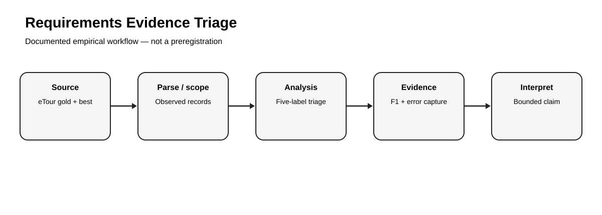
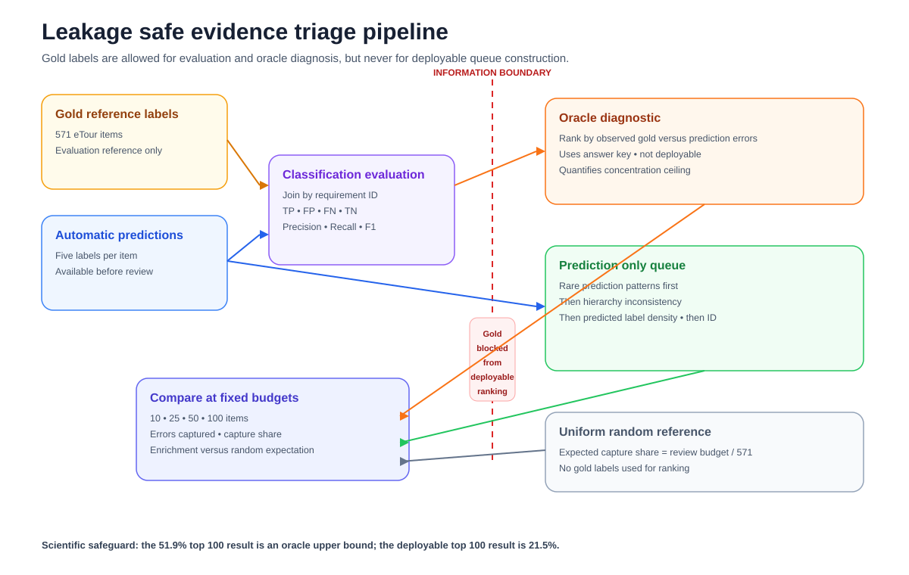
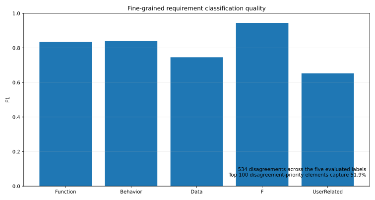
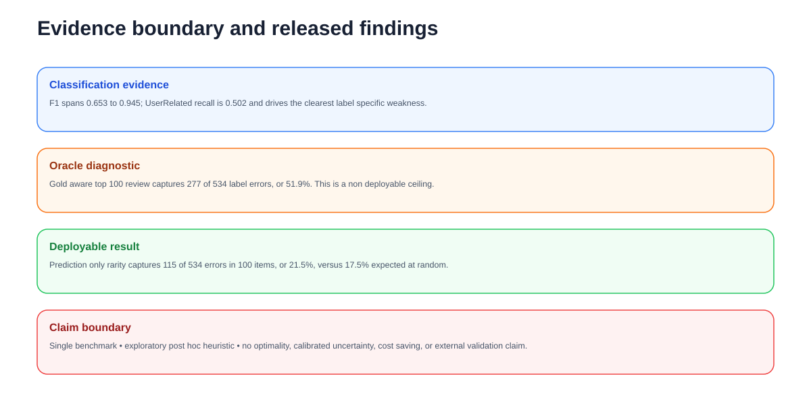

# Requirements Classification Evidence Triage on a Gold-Standard Benchmark

> **Empirical Research Bundle** · **Portfolio Track: Engineering Management Research** · Systems Engineering / Requirements Engineering / Human Review

Empirical eTour benchmark study of five requirement-element labels, classification error structure, and budgeted human-review triage.



## Study status

**Completed secondary empirical analysis.** Reported findings were calculated from the named public source on 25 September 2026. The rebuild script contains **no synthetic fallback**. Raw source data are not republished unless source terms permit it; `data/source_manifest.json` records provenance, retrieval details, licensing notes, and the claim boundary.

## Research question

> Where does automatic fine-grained requirement classification fail on a gold-standard benchmark, and how concentrated are those errors under a limited human-review budget?

## Design

- **Design:** Secondary benchmark evaluation with disagreement-priority human review
- **Source:** eTour fine-grained requirements-classification benchmark in the FTLR replication package
- **Source page:** https://github.com/tobhey/finegrained-traceability
- **Direct data endpoint:** `https://raw.githubusercontent.com/tobhey/finegrained-traceability/diss_v1/datasets/eTour/eTour_gold.csv ; https://raw.githubusercontent.com/tobhey/finegrained-traceability/diss_v1/datasets/eTour/eTour_best.csv`
- **Retrieval / analysis date:** 2026-09-25
- **Licensing / reuse note:** Gold-standard requirements-classification dataset: CC BY 4.0 (Zenodo DOI 10.5281/zenodo.7867846). Automatic predictions are taken from the cited FTLR replication repository.

## Hypotheses

1. H1: classification quality differs substantially across the five evaluated labels (Function, Behavior, Data, F, UserRelated).
2. H2: UserRelated evidence has materially lower recall than the broad F label.
3. H3: disagreement-priority review captures a disproportionate share of five-label errors within a fixed review budget.

## Empirical method

Join gold-standard and automatic rows by requirement-element ID. For the five labels explicitly evaluated by the FTLR experiment (Function, Behavior, Data, F, UserRelated), compute confusion matrices and F1. Count per-element disagreements across those five labels, sort descending, and measure cumulative error capture at review budgets of 10, 25, 50, and 100 elements.



## Headline empirical finding

Across the five evaluated labels, F1 ranges from 0.653 for UserRelated to 0.945 for F. There are 534 label disagreements in total; reviewing the 100 elements with the most five-label disagreements concentrates 277 of them (51.9%).

### Headline metrics

- **n requirement elements**: 571
- **f1 function**: 0.834
- **f1 behavior**: 0.839
- **f1 data**: 0.746
- **f1 F**: 0.945
- **f1 user related**: 0.653
- **total label errors across 5 fields**: 534
- **top 100 review error capture share**: 0.519

The packaged derived tables are documented in `docs/data_dictionary.md`. That document states explicitly whether each CSV is a complete analysis table or a diagnostic subset.



## What this study can and cannot claim

**Can claim:** the computations in this repository summarize the named public dataset under the documented operationalization.

**Cannot claim:** The benchmark evaluates requirement-element classification, not end-to-end physical-system verification. The four additional fields in the CSVs (functional, OnlyF, OnlyQ, Q) are excluded from the triage estimand because the supplied eTour automatic file is degenerate for those fields (all-zero outputs), so treating them as ordinary predictions would inflate disagreement counts and misstate the classifier output.



## Reproduce

Offline verification of packaged empirical results:

```bash
python -m pip install -r requirements.txt
pytest -q
python run_demo.py
```

Recompute the empirical analysis from the public source (internet required):

```bash
python scripts/fetch_and_analyze.py
```

The online rebuild calls study-specific functions from `research/model.py`; the tests exercise those functions and scientific invariants rather than only checking file presence.

## Research bundle contents

- `README.md` — study overview and bounded findings
- `EMPIRICAL_STUDY.md` — protocol, validity, and interpretation
- `data/source_manifest.json` — provenance, license note, and claim boundary
- `data/derived/` — compact derived empirical tables
- `results/empirical_summary.json` — machine-readable headline results
- `scripts/fetch_and_analyze.py` — public-source rebuild
- `research/model.py` — reusable study-specific analysis functions
- `tests/` — behavioral and scientific-invariant tests
- `docs/` — analysis plan, data dictionary, paper blueprint, references, originality map
- `assets/` — four study-specific SVG figures

## Research integrity

This bundle distinguishes **source data**, **operationalization**, **result**, and **interpretation**. The analysis plan documents the released analysis; it is **not described as preregistered**. Public data do not automatically validate a construct, so proxy and external-validity limits are explicit.
